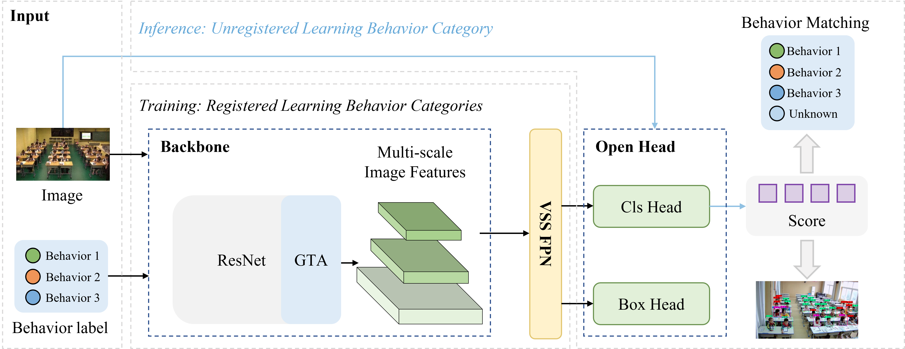
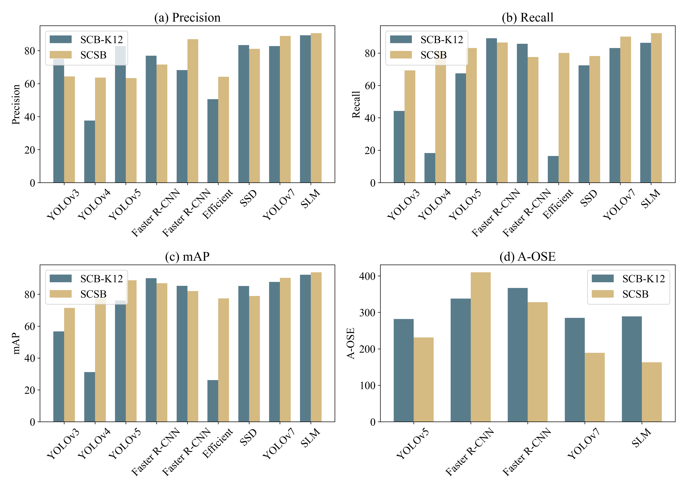

# SLB-Mamba: A Lightweight Vision Mamba for Closed and Open Set Student Learning Behavior Detection with Game-Theoretic Attention

# 📝Introduction📝

This repository contains the code implementation for the paper **SLB-Mamba: A Lightweight Vision Mamba for Closed and Open Set Student Learning Behavior Detection with Game-Theoretic Attention**. SLB-Mamba is designed to efficiently detect and classify student learning behaviors in both closed and open set environments, leveraging game-theoretic attention mechanisms to improve accuracy and robustness.

The current version has been tested on Linux systems with PyTorch 2.0.0 and CUDA 11.7, and it supports Python 3.11.8. The code is also compatible with CUDA 11.7+ versions.

If you find this project useful, please give us a star ⭐️. Your support is our greatest motivation!

# 📌Installation📌

To set up the SLB-Mamba environment, follow these steps:

- pip install torch==2.0.0 torchvision==0.15.1 torchaudio==2.0.1 

- pip install packaging

- pip install timm==0.4.12

- pip install causal-conv1d==1.2.0.post2 

- pip install mamba-ssm==1.2.0.post1 

# 📜Other requirements📜

- Linux System

* NVIDIA GPU

+ CUDA 11.7+

# 🚀Performance🚀

# Contact Us
If you have any other questions❓, please contact us in time 👬

